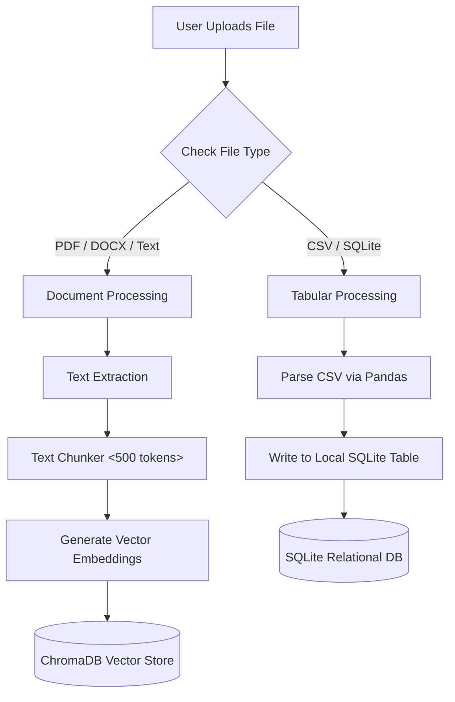
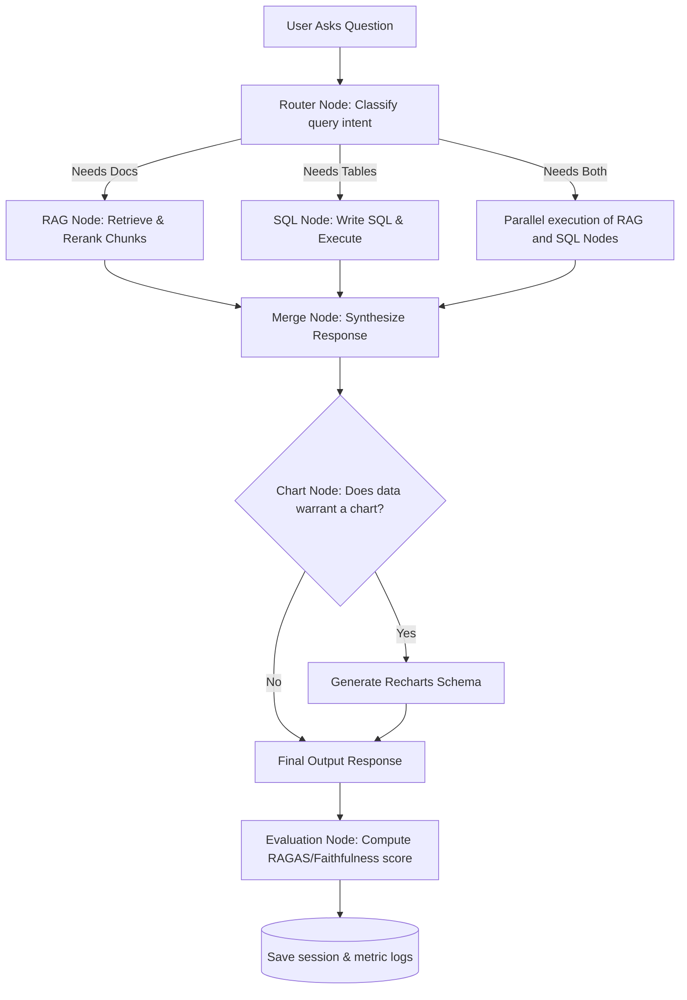

# Enterprise AI Analyst: Project Blueprint

This blueprint outlines the complete design, architecture, and technology justifications for building the **Enterprise AI Analyst** from scratch. 

---

## 1. About This Project

In enterprise environments, data is split into two formats:
1. **Unstructured Data**: Word documents, PDFs, contracts, and transcripts.
2. **Structured Data**: Databases, CSV files, customer tables, and spreadsheets.

Normally, if a business analyst wants answers from both, they must:
* Open documents and use `Ctrl + F` (manual reading).
* Write SQL queries or ask a database engineer to retrieve tables.
* Manually copy the numbers into Excel to generate a chart, and write a summary.

**Enterprise AI Analyst** merges these workflows into a single AI-powered web console. A user uploads files (PDFs, CSVs, or databases) and types questions in plain English. The backend "brain" dynamically decides where the answers live, runs the extraction pipelines, synthesizes the results, generates interactive charts, and compiles exportable PDF reports.

---

## 2. Technology Stack & Why It Fits AI/ML Roles

To stand out in today's AI/ML hiring market, you need to show you understand **reliability, security guardrails, evaluation, and stateful agent coordination**—not just calling API wrapper endpoints. 

Here is the tech stack selected for this project and the enterprise-level "why" behind each choice:

| Technology | Role | Why It is Selected (Enterprise AI/ML Value) |
| :--- | :--- | :--- |
| **LangGraph** | Agent Stateful Orchestration | **Agentic state control.** Unlike basic chains, LangGraph allows us to define agents as State Machines (Graphs with Nodes and Edges). This is the industry-standard framework for building reliable multi-agent systems with loops (e.g., query self-correction). |
| **LangChain** (Selective Utility Packages) | Unified Interfaces & Helper Tools | **Avoiding the "Black Box" mistake.** We will **not** use pre-built magic chains (like `create_sql_agent` or `ConversationalRetrievalChain`) because they are hard to customize, debug, and secure. Instead, we only use LangChain's core wrappers (e.g., `ChatOpenAI`, `RecursiveCharacterTextSplitter`) to easily swap models and chunk text. |
| **Google Gemini & OpenAI** (Interchangeable) | Core LLM reasoning | **Structured function calling.** Using LangChain’s abstraction, you can swap between Gemini 1.5/2.0 and GPT-4o-mini via simple `.env` flags. They offer robust JSON formatting and tool-calling capabilities. |
| **ChromaDB + BM25** | Hybrid Vector Store / Retrieval | **Hybrid retrieval.** Basic vector search (ChromaDB) often misses specific keywords, while keyword search (BM25) misses semantic meaning. We combine both (dense + sparse) to simulate production-grade search engines. |
| **Cohere Rerank API** | Post-Retrieval Reranking | **True context relevance.** A vector store retrieves chunks based on geometric distance, not context. Cohere Rerank acts as a secondary "cross-encoder" that evaluates retrieved chunks against the query and re-orders them, boosting answer quality. |
| **SQLParse & SQLAlchemy** | SQL Guardrails & Execution | **Security & Correctness.** We use `sqlparse` to inspect the generated SQL AST (Abstract Syntax Tree) to block any modifying statements (like `DROP`, `DELETE`, `UPDATE`), and use SQLAlchemy to execute SELECT-only queries safely. |
| **RAGAS & LLM-as-a-Judge** | Evaluation Layer | **LLM Quality Assurance.** Enterprises require quantitative proof of system accuracy. RAGAS evaluates the generation pipeline using metrics like *Faithfulness* (is it hallucinating?), *Answer Relevance*, and *Context Recall*. |
| **FastAPI** | Asynchronous API Backend | **Performance & Autodocs.** FastAPI is Python's standard for async web services. It automatically generates interactive OpenAPI/Swagger docs (`/docs`), making API integration clean and professional. |
| **Vite + React + Recharts + Tailwind** | Frontend Client | **Modern, responsive client dashboard.** Streamlit is too simple for resume impact. A custom React client demonstrates your capability to build user-facing enterprise analytical dashboards, handle state, and render complex charts. |

---

## 3. Use Case of This Project

### Real-World Business Value
This tool bridges the gap between non-technical business professionals and raw data stores:

1. **Business Analysts & Managers**:
   * *Problem*: Wants to query transactional tables but does not know SQL.
   * *Use Case*: Asks "Show me our top 10 customers by revenue and chart it" $\rightarrow$ gets a clean table and interactive bar chart instantly.
2. **Legal & Compliance Officers**:
   * *Problem*: Has to read hundreds of pages of contracts to cross-check clauses.
   * *Use Case*: Asks "What are the cancellation penalties in this agreement?" $\rightarrow$ gets a direct, summarized answer with the exact source quoted and page references.
3. **Executives & Decision Makers**:
   * *Problem*: Needs to verify if verbal/written reports match database transactions.
   * *Use Case*: Asks "Does the sales target stated in the Q3 summary report match our actual orders database?" $\rightarrow$ the router triggers both RAG and SQL systems and synthesizes a comparison summary.

---

## 4. Core Features of the Project

1. **Dynamic Intent Routing**: The system classifies input queries as document-based, data-based, or mixed, and forwards the workflow along the optimal graph branch.
2. **Citation-Backed RAG**: Answers are grounded by extracting exact sentences, displaying page references and file source links so users can audit the AI's claims.
3. **Self-Correcting SQL Agent**: If the SQL query fails (e.g., column name mismatch), the agent reads the database error, rewrites the query, and re-executes it up to 3 times before reporting.
4. **Insight Visualization**: Detects tabular outputs and automatically creates visual configurations (bar charts, line graphs, pie charts) for the UI.
5. **On-Demand PDF Compilation**: Renders a clean PDF report incorporating the user's query, synthesized text, raw tables, and inline charts.

---

## 5. Graphical Representation

### 5.1 Data Ingestion Pipeline
When files are uploaded:



### 5.2 Query Runtime Pipeline (LangGraph Workflow)
When a user asks a question, this stateful graph executes:



---

## 6. Folder Structure & File Descriptions

Here is the exact structure of the workspace and what each file does:

```
/Enterprise-AI-Analyst/
├── backend/
│   ├── app/
│   │   ├── __init__.py
│   │   ├── main.py            # Entry point for FastAPI, mounts routers & middleware
│   │   ├── config.py          # Configuration parser, loads .env keys and directory targets
│   │   ├── core/
│   │   │   ├── agent.py       # LangGraph state machine, nodes, and routing edges
│   │   │   ├── rag.py         # Handles text extraction, embedding, hybrid search & reranking
│   │   │   ├── sql.py         # Inspects SQLite schemas, writes/validates/corrects SQL queries
│   │   │   ├── evaluator.py   # RAGAS evaluator running check metrics after answer synthesis
│   │   │   └── reporter.py    # Formats Plotly chart config & builds PDF reports via ReportLab
│   │   ├── database/
│   │   │   └── connection.py  # Handles connection sessions to local SQLite databases
│   │   └── api/
│   │       ├── routes.py      # Endpoints: /upload, /chat (runs graph), /export-pdf
│   │       └── schemas.py     # Pydantic schemas validating input/output JSON payloads
│   ├── requirements.txt       # Lists exact python dependency versions
│   └── .env.example           # Template for environment keys (Gemini, Cohere, OpenAI)
├── frontend/
│   ├── src/
│   │   ├── components/
│   │   │   ├── Sidebar.jsx        # Navigation, upload summaries, chat history lists
│   │   │   ├── ChatWindow.jsx     # Renders messages, dynamic data tables, and citation dropdowns
│   │   │   ├── FileUploader.jsx   # Drag-and-drop zone with animated state hooks
│   │   │   └── ChartRenderer.jsx  # Adapts backend JSON schemas into interactive Recharts
│   │   ├── context/
│   │   │   └── ApiContext.jsx     # Handles API requests and authentication state
│   │   ├── App.jsx            # Assembles layout grids, theme toggles, and UI states
│   │   └── main.jsx           # Mounts the React application
│   ├── package.json           # Defines React dependencies (axios, tailwindcss, recharts)
│   ├── tailwind.config.js     # Configures colors, fonts, and dark mode triggers
│   └── vite.config.js         # Configures development server proxy rules
└── data/                      # Local directories mapped in gitignore
    ├── documents/             # Backup storage for raw uploaded PDFs/DOCXs
    ├── sqlite/                # Holds active SQLite database files (.db)
    └── chroma/                # Directory containing ChromaDB vector collections
```

---

## 7. Premium UI/UX Design System (The "Wow" Factor)

To make the dashboard look like a production enterprise app rather than a simple tutorial:

1. **Color Palette (Dynamic Dark/Light Mode)**:
   - **Dark Mode (Default)**: Deep slate backgrounds (`#0B0F19`), rich glassmorphic layers (translucent card borders), and vibrant gradient borders.
   - **Accents**: HSL-tailored colors—Electric Indigo (`#6366F1`) for primary actions, Teal (`#0D9488`) for RAG routes, Coral (`#F97316`) for SQL routes, and Purple (`#A855F7`) for routing decisions.
2. **Glassmorphism & Layout Grid**:
   - A modern 3-column layout:
     * **Left Column**: Collapsible navigation bar detailing uploaded files and history lists, with thin translucent border lines.
     * **Middle Column (Main)**: Interactive Chat interface with custom animations.
     * **Right Column**: Dynamic analytics panel containing tables, toggleable chart tabs (Bar, Line, Radar), and RAG audit logs showing reranked scores.
3. **Micro-Animations & Transitions**:
   - Smooth transitions for opening collapse panels, switching theme modes, and toggling charts.
   - Animated upload states showing a file uploading progress bar and converting it to embeddings with micro-indicators.
   - Shimmer loaders (skeleton views) showing the state of the LangGraph node currently executing (e.g., "Analyzing document structure...", "Translating question to SQL...").
