# 🏢 Enterprise AI Analyst

[](https://www.python.org/)
[](https://nodejs.org/)
[](https://fastapi.tiangolo.com/)
[](https://react.dev/)
[](https://opensource.org/licenses/MIT)
[](https://github.com/langchain-ai/langgraph)
[](https://enterprise-ai-analyst.onrender.com)

> **Tagline:** An agentic, multi-modal enterprise intelligence console that queries, analyzes, and visualizes unstructured documents (PDF, DOCX) and structured databases (CSV, SQLite) simultaneously using natural language.

### 🌐 [**→ Try the Live Demo: enterprise-ai-analyst.onrender.com**](https://enterprise-ai-analyst.onrender.com)

⚠️ Note: The free tier instance spins down after 15 minutes of inactivity. First request may take 30–60 seconds to wake up.

---

## 📖 Table of Contents
1. [Overview](#-overview)
2. [Key Features](#-key-features)
3. [Architecture](#-architecture)
4. [Tech Stack](#-tech-stack)
5. [Local Quick Start](#-local-quick-start)
6. [Folder Structure](#-folder-structure)
7. [API Reference](#-api-reference)
8. [Running Tests](#-running-tests)
9. [Docker Deployment](#-docker-deployment)
10. [Troubleshooting](#-troubleshooting)
11. [Contributions & License](#-contributions--license)

---

## 🔍 Overview

Enterprise AI Analyst bridges the gap between structured databases and unstructured documents. Users can upload various files—such as marksheets, resumes, contracts, or sales databases—and query them in plain English. The platform dynamically routes queries, fetches relevant facts, executes secure SQL queries, generates charts, and exports full session records as styled PDF reports.



---

## ✨ Key Features

* **Smart Intent Routing:** Classifies user intent dynamically between document retrieval (`rag`), database querying (`sql`), or both (`hybrid`).
* **Hybrid RAG Pipeline:** Combines ChromaDB vector retrieval + BM25 keyword search with Cohere reranking for factual precision.
* **SQL Generation & Guardian:** Translates natural language to SQLite commands with AST-based safety checks to block mutation commands (DROP, DELETE, etc.).
* **Dynamic Charting:** Detects visualizable tabular trends from query responses and renders interactive charts (Bar, Line, Area, Pie) via Recharts.
* **LLM-as-Judge Evaluation:** Scores answer relevance, faithfulness, and context recall in real-time.
* **PDF Report Exports:** Compiles queries, charts, tabular grids, and source citations into styled PDF documents.
* **Conversational Memory:** Re-writes follow-up inputs based on chat history threads.
* **Voice Ingestion:** Transcribes voice queries to text inputs.

---

## 🏛️ Architecture

The backend utilizes a **LangGraph StateGraph** to coordinate multi-agent nodes:

```
User Query
    │
    ▼
[1. Router Node] ──── Classifies intent: "rag" / "sql" / "hybrid"
    │
    ├── "rag"    ──► [2. RAG Node] ──► ChromaDB Vector + BM25 + Cohere Rerank
    ├── "sql"    ──► [3. SQL Node] ──► NL-to-SQL -> Guardian Check -> Execute -> Retry Loop
    └── "hybrid" ──► Parallel Fan-Out to RAG and SQL Nodes
                           │               │
                           └───────┬───────┘
                                   ▼
                          [4. Merge Node]    ──► LLM synthesizes final answer
                                   │
                          [5. Chart Node]    ──► Auto-detects chart configurations
                                   │
                          [6. Evaluation Node] ──► Faithfulness, Relevancy, and Recall grading
                                   │
                               Response
```

---

## 🔧 Tech Stack

* **Backend Framework:** FastAPI + Uvicorn
* **Agentic Orchestration:** LangGraph (StateGraph)
* **AI Models:** Google Gemini 1.5 Flash (Default) / OpenAI GPT-4o-mini
* **Vector Database:** ChromaDB (Persistent)
* **Document Parsing:** PyMuPDF (`fitz`), Python-Docx, Tesseract OCR
* **PDF Compilation:** ReportLab + Matplotlib
* **Frontend UI:** React 18 + Vite + Tailwind CSS
* **Visualization Layer:** Recharts
* **Database Layer:** SQLite + SQLAlchemy + Pandas

---

## 🚀 Local Quick Start

### Prerequisites
* Python 3.10+
* Node.js 18+
* Google Gemini or OpenAI API Key (Optional — fallback mock LLM is available)

### Option A: Automated One-Command Setup
```bash
chmod +x setup.sh
./setup.sh
```

### Option B: Manual Setup

#### 1. Backend Server Setup
```bash
cd backend
python3 -m venv venv
source venv/bin/activate # On Windows use: venv\Scripts\activate
pip install -r requirements.txt
cp .env.example .env
# Edit .env to add your API keys
uvicorn app.main:app --port 8000 --reload
```
API Documentation: `http://localhost:8000/docs`

#### 2. Frontend Client Setup
```bash
cd frontend
npm install
npm run dev
```
Open: `http://localhost:5173`

---

## 🗂️ Folder Structure

```
Enterprise-AI-Analyst/
├── backend/                   # Python FastAPI Backend
│   ├── app/
│   │   ├── main.py            # App entry point
│   │   ├── api/               # Router endpoints & schemas
│   │   └── core/              # State machines & logic (agent, RAG, SQL)
│   └── tests/                 # Unit and E2E test scripts
├── frontend/                  # React Vite Frontend
│   ├── public/                # Static icons & animated diagrams
│   └── src/                   # Components & state contexts
├── data/                      # Persistent SQLite & ChromaDB folder
├── Dockerfile                 # Backend container configuration
├── docker-compose.yml         # Container orchestration template
└── setup.sh                   # Script for automatic server boot
```

---

## 🌐 API Reference

### `POST /api/chat`
Submit natural language query.
```bash
curl -X POST http://localhost:8000/api/chat \
  -H "Content-Type: application/json" \
  -d '{"query": "What is my total GPA score?", "session_id": "session-123"}'
```

### `POST /api/upload`
Upload a source file for processing.
```bash
curl -X POST http://localhost:8000/api/upload \
  -F "file=@/path/to/marksheet.pdf"
```

---

## 🧪 Running Tests
All tests run locally using the offline mock LLM context:
```bash
cd backend
python3 tests/test_e2e_complete.py   # Run 7-scenario E2E checks
python3 tests/test_sql_engine.py     # Verify SQL Guardian blocking rules
python3 tests/test_state_machine.py  # Verify LangGraph orchestration
```

---

## 🐳 Docker Deployment

### Local Docker
```bash
docker-compose up --build
```
* Backend + Frontend: `http://localhost:8000`

### ☁️ Live Deployment (Render.com)
The app is deployed and live at:

> **🚀 [https://enterprise-ai-analyst.onrender.com](https://enterprise-ai-analyst.onrender.com)**

> ⚠️ **Note:** The free tier instance spins down after 15 minutes of inactivity. First request may take 30–60 seconds to wake up.

---

## 🤝 Contributions & License

### Contributions
Contributions are welcome. Please submit a Pull Request or open an Issue to propose changes or report bugs.

### License
This project is licensed under the MIT License. Feel free to use, modify, and distribute.
